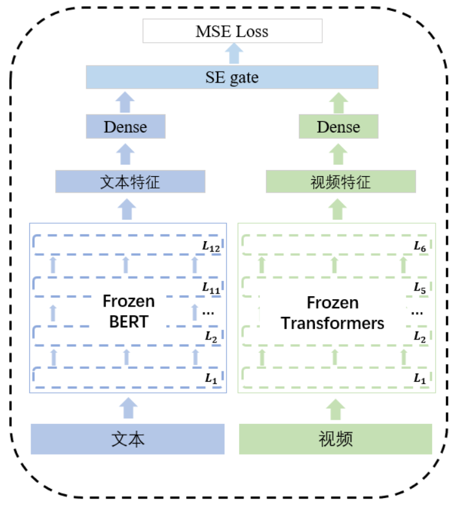
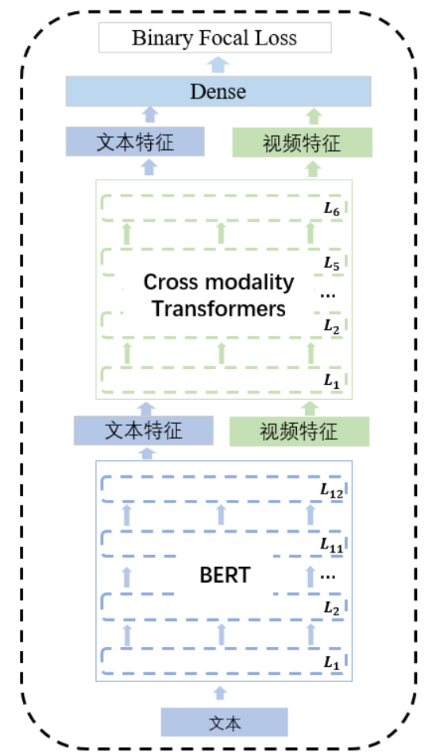
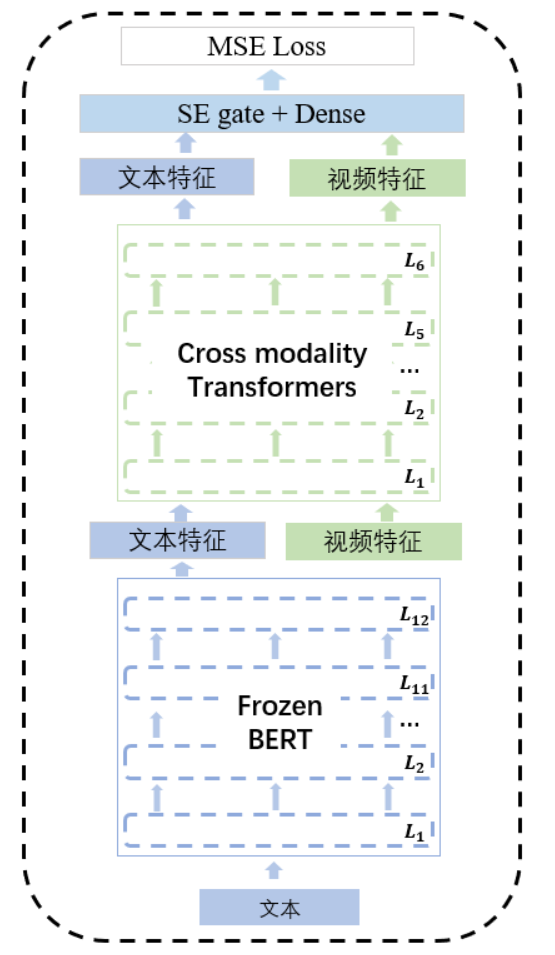

# 2021 AIAC 赛道一-两面包夹芝士方案 决赛第17名
### 1. 文件结构
.
|-- **checkpoint** checkpoints存放路径  
|-- **data** bert模型和训练数据存放路径  
|-- **lichee** 官方lichee库  
|-- **logs** 日志文件  
|-- **model** 模型文件  
|-- **result** 结果存放路径  
|-- **util** 工具类  
|-- **evaluate.py**   
|-- **evaluate_multi_bert.py**   
|-- **finetune_data_gen.py**  
|-- **finetune_multi_bert_unfrozen_1_unsup_all.py**   
|-- **finetune_simnet_13_unsup_all.py**   
|-- **post_process.py**  
|-- **requirements.txt**  
|-- **run.sh**  推理文件  
|-- **sort_label.py**  
|-- **train.sh**  预训练文件  
|-- **train_multi_bert_tag.py**  
|-- **train_text_model_focal_2.py**  
|-- **train_video_model.py**     

### 1. 模型介绍

**模型分预训练和微调两个阶段，其中预训练是使用pointwise作为训练数据，任务为tag多分类；微调阶段使用pairwise作为训练集，任务为视频对相似度回归任务**

####  **模型一预训练：**

- 文本使用bert；

- 视频使用6层transformers

- 使用Binary focal loss对两种模态网络分别进行tag多分类预训练

- 优化器：BertAdam lr: 5e-5

  

#### **模型一微调：**

- 将bert和视频transformers进行冻结；
- 使用全连接层将文本和视频embeddings映射到256；
- 使用se-gate进行融合获得视频embedding；
- 将pairwise的视频对embeddings取出计算余弦相似度并和label做mse loss；
- 对没有出现在label.tsv文件中的视频对做了一个**半监督loss**。具体地，我们将每个batch中的视频进行两两配对，如果该视频对在label中出现，则是取label做mse loss；如果视频对没有在label中出现，则将**0、0.5、1作为它们标签，并计算loss**，最后取三者中最小的loss进行梯度回传。
- 优化器：BertAdam lr: 3e-4

#### **模型二预训练：**

- 文本使用bert， 并取最后一层的32*768的embedding；
- 将视频原始32\*1536的embedding降维到32\*768embedding，并和上面获得的text embedding拼接成64*768的embedding；
- 将64*768的embedding输入到6层的cross modality transformers中；
- 使用Binary focal loss对该网络进行tag多分类预训练；
- 优化器：BertAdam lr: 5e-5

#### **模型二预训练：**

- 将bert进行冻结；
- 将cross modality transformers输出的embedding依次输入到se-gate和全连接层降维到256；
- 将pairwise的视频对embeddings取出计算余弦相似度并和label做mse loss；
- 同样使用半监督loss；
- 优化器：BertAdam lr: 2e-5

### **2. 环境配置**

- python 3.7   
- pip install -r requirements.txt      

### **3. 模型融合**

- 使用finetune后的模型一进行推理，得到256维的embedding；
- 使用finetune后的模型二进行推理，得到256维的embedding；
- 将两个embedding相加后，做normalization

